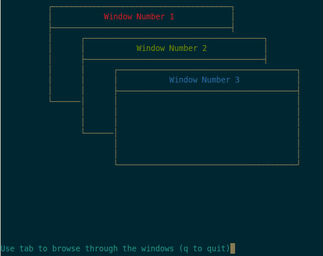

# Introduction

Every CEO knows that managing a company is hard. In order to improve gaining 
experience of leading a company - such a _brand and fresh_ CEO has to have, in between, 
tools to manage a comapny (initially this applies to an IT company).

Tools allow not only working faster, but also lowers costs of running a company
plus standarizes workflow to the highest one (among contributors).
Everyone benefts.

Not everyone can afford having fancy services offering improvements in organising
workflow of a company, but there are already open-source tools on the market, 
what is needed is only merging all of those tools and that is all!

This is where **Preeteam** comes into play.

Preeteam aims at solving problems with establishing easy, reliable and accessible
means of communication, collaboration and organisation within not only a company,
but also any group of collaborating people.

In longer term one should be able to create IT-infrastructure being a real alternative 
for paid SaaS-es by executing just 1 one-liner like

    git clone ... && make all && preeteam localhost:8080 exim4 nginx ldap ${FAVOROUITE_COLLABORATIVE_CHAT} ${FAV_TASK_MANAGEMENT_SYSTEM ${FAV_REPOSITORY_MANAGER} ${FAV_CI} ${FAV_DOCS_SYSTEM} --backup daily,1am --backup-cmd "wget -O - https://backup.company.com/triggerBackup?ip=$THIS_PC_IP" --storage /mnt/raid6

# Running

    bash gui-wizard/vendor/panels.cpp # yes! Running a cpp file in... bash!

# Screenshot

